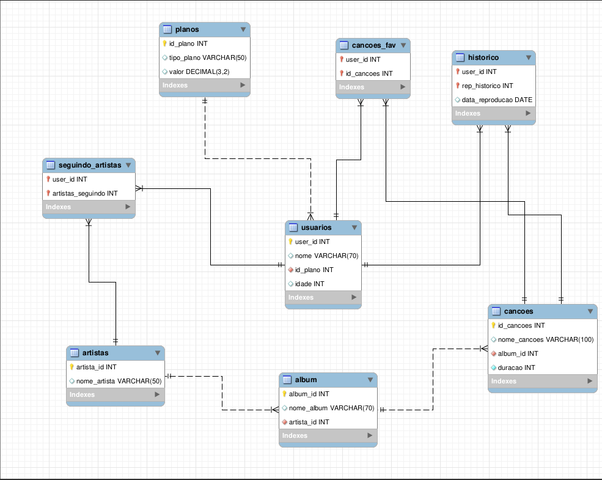

# :spiral_notepad: MySQL One-for-all :spiral_notepad:

 

 

 

# :clipboard: About
O projeto tinha como objetivo testar os conhecimentos na criação de banco de dados e na manipulação das tabelas dentro do mesmo, utilizando o MySQL junto do Workbench
dentro de um container Docker criado pelo Docker Coompose.
 
Nele foi criado um banco de dados, seguindo as 3 formas normais, a partir de uma planilha do Exel. Logo depois realizado diversos exercicios na manipulação das tabelas,
utilizando algumas funçoes do MySQL como: SELECT, JOIN, AGROUP BY, ORDER BY, LIMIT, entre outras.
 

 

# :hammer_and_wrench: Skills & Tools

- Docker
- Docker Compose
- MySQL
- MySQL Workbench

 

 
